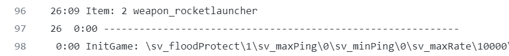
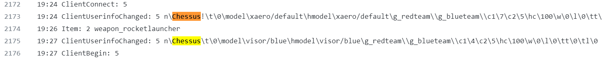

Here I share some thoughts about the logic-building and architecture of this project.

### Establishing each game's scope
After deciding which best tool to use to parse the log-file (Python), the first step was to define
where each match/game started and ended.
Since the given log is not perfect (they rarelly are), the **first obstacle** was to handle
the absence of a clear ending line for one the matches, specifically, the game # 2

*'ShutdownGame' line was not found!* -->

I had to be creative and to include, in 'game_number' helper function, a conditional that if no ShutdownGame
were to be found, then the next InitGame occurence would suffice to end it.

### Players updating their names during the match
This was a tricky one and almost past unseen. In two instances, a player entered as "Chessus!"
and then updated his name to only "Chessus". This had to be handled to avoid redundancy data and false-score rankings

*By the Client's id it's clear that they are the same player* -->

### Excluding the `<world>`
Everytime a player is killed by the game/scenario, it shows a default "world" entity doing the act.
This event triggers a penalty to that player, henceforth awarding a -1 to that players' score.
I had to decide whether to render a negative score for players losing more than gaining or to reset it to zero,
in the end, it seemed fairer to *not* reseting it. Let them be more careful next time!

