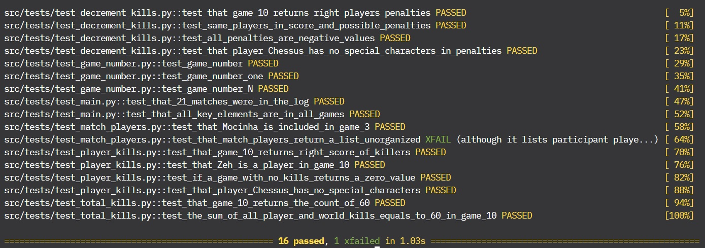

### Running up tests

Make sure you are in project's root folder
Then, run the tests suite to run it all:
```js
python3 -m pytest -v
```
You should have a similar return, like this:


*All helper and main functions running.*

:::note

Note that we have a 1 xfailed test. It was purposely made to show that the list of
players comes in random order. Nonetheless, it does not affect the final results, since
the output will be ranked from the best to lowest score (in terms of kills in the game).

:::

In order to run a specific test, copy its relative path and add to the pytest regular command. For example:

```js
python3 -m pytest src/tests/test_player_kills.py -v
```